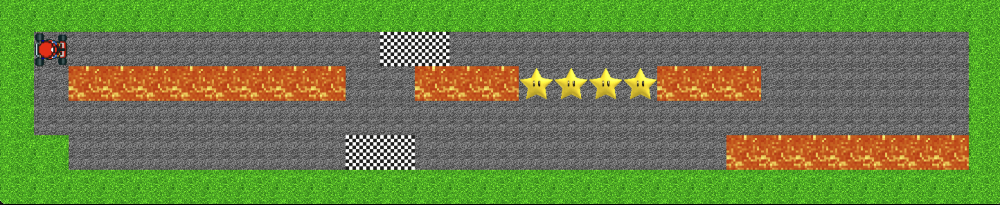

# 🏎️ Mario-Kart-Mini – a 2‑D racing sandbox in Python 3

> **Quick demo**  
> • Manual driving – `assets/human.mov`  
> • AI‑driven racing – `assets/ai.mov`


<summary>📺 Show inline players</summary>

<p align="center">
  <br/>Keyboard
  <br/>
  <video src="assets/human.mov" width="420" controls muted></video>
  <br/>CPU
  <br/>
  <video src="assets/ai.mov"     width="420" controls muted></video>
</p>


---

## 1 · What it is

A bite‑sized, top‑down **Mario Kart‑style** game built with **Pygame**:

* Maps are **ASCII strings** → instant prototyping  
* Race solo with the keyboard *or* watch the **A\*** path‑finding AI clear the circuit  
* Supports boosts, lava pits, checkpoints, lap timing & collision

<p align="center">
  
</p>

---

## 2 · Track grammar

Each character in the level string becomes a 32 × 32 px tile:

| Char | Tile       | Behaviour                                                   |
|------|------------|-------------------------------------------------------------|
| `G`  | Grass      | Off‑track – slows karts                                     |
| `R`  | Road       | Normal driving surface                                      |
| `C`  | Checkpoint | Must be crossed (in order) for a valid lap                  |
| `B`  | Boost      | Big boost of speed                                          |
| `L`  | Lava       | Instant **K.O.** – resets to the last checkpoint            |

Minimal example:

```python
string = 
    """GGGGGGGGGGGGGGGGGGGGGGGGGGGGGG
    GRRRRRRRRRRCCRRRRRRRRRRRRRRRG
    "GRLLLLLLLLRRLLLBBBBLLLRRRRRRG
    "GRRRRRRRRRRRRRRRRRRRRRRRRRRRG
    "GGRRRRRRRRCCRRRRRRRRRLLLLLLLG
    "GGGGGGGGGGGGGGGGGGGGGGGGGGGGG"""

```

---

## 3 · The AI – A\* with racing tweaks

* **Graph** – each road tile is a node; edges connect drivable neighbours  
* **Heuristic** – Euclidean distance to the current goal checkpoint  
* **Post‑processing** – the raw path is simplified into way‑points for smoother steering  

> **Limitations**  
> • A\* ignores **physics** (inertia), so at high speed the kart can’t always pivot in time  
> • Boosts (`B`) look attractive to A\* yet often sling the kart straight into lava  
> • A brake‑when‑turning heuristic mitigates sharp corners, but you’ll still see the bot “panic‑slide” occasionally

---

## 4 · Controls

| Action             | Key binding |
|--------------------|-------------|
| Accelerate         | ↑   |
| Brake / Reverse    | ↓    |
| Steer left / right | ← / →  |


---

## 5 · Getting started

```bash
# 1 – Clone & install deps
git clone https://github.com/leaveyoustun/mario-kart-mini
cd mario-kart-mini
pip install pygame     # if not installed

# 2 – Play!
python main.py            # switch the controller to AI or Human in main.py based on what you want to do    
```


